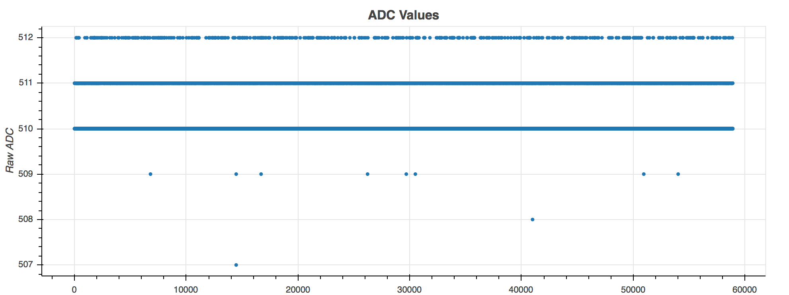
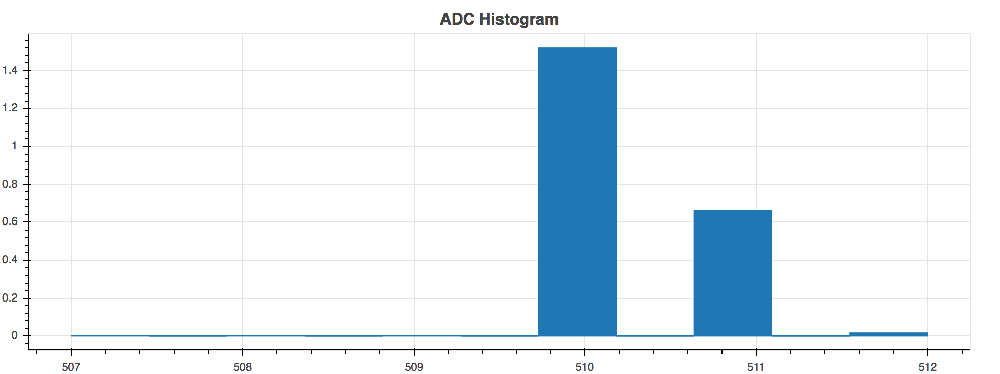
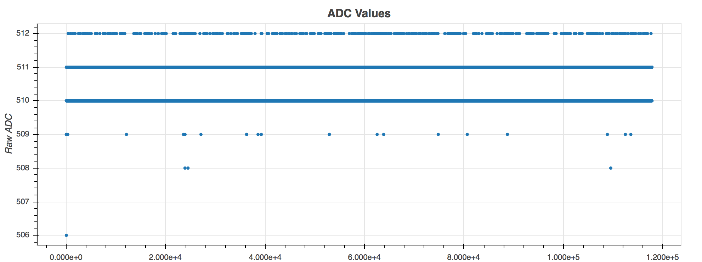
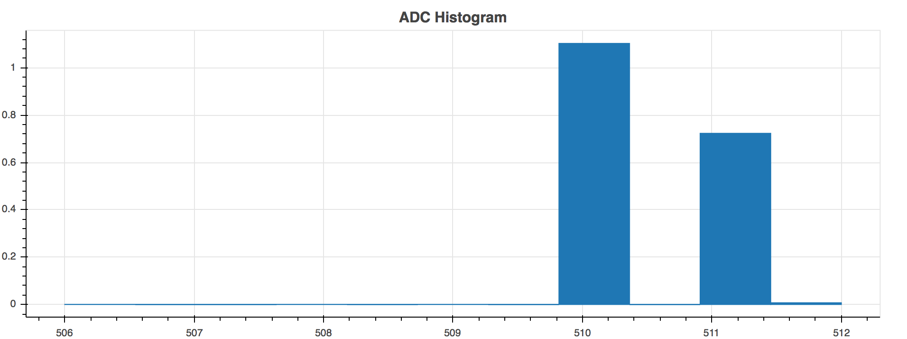

### ADC Testing

#### Setup
Using PCB, a divider network (2x 10k resistors) feeds the ADC. Software  samples a single ADC channel every 10ms. For the first test, the relay isn't triggered. This test was run for 10 minutes. For the second test, the relay randomly opens/closes every 0.1 to 1 second. This test was run for 20 minutes.

#### Results
From the MCP3008 data sheet, the ADC has a max error of ±2LSB (±1LSB Integral Nonlinearity and ±1 Gain error).

Currently, the system has an error of ±2.5 and ±3LSB with no relays and relays triggering.

#### Comments/Recommendations
From the plots, there are very few "outliers". On the next PCB revision, a small RC filter will be added to the front of the ADC input. The a more precise reference will be added to the ADC.

My 2 cents on data sheets. It's impossible to achieve the specifications listed on data sheets. They preforms these tests in optimal conditions and not real world conditions. Instead, the focus should be on determining how well the ADC preforms for the task selected. In this case, will the sensor's output be affected with a ±3LSB or is that insignificant?

#### Data

|  | No Relay Triggered | Relay Triggered |
| --- | --- | --- |
| Samples Collected | 58910 | 117815 |
| Mean | 510.315922594 | 510.402037092 |
| Median | 510.0 | 510.0 |
| Min | 507 | 506 |
| Max | 512 | 512 |
| Min/Max Diff | 5 | 6 |

###### No Relays Triggered

###### Relays Triggering

